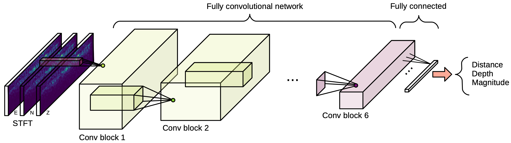

#  Complex Neural Networks for Earthquake Source and Magnitude Estimation                                                                                  

We propose a convolutional neural network (CNN) architecture based on complex algebra in order to estimate the distance, depth and magnitude of a seismic event.   
We provide the code for training our model on the STEAD data set.

-----------------------------------------



-----------------------------------------                                                                                                                                      
#### Information

The STEAD data set can be downloaded from https://github.com/smousavi05/STEAD. 

Be aware that STEAD authors during time have published more links to download the data set. You have to be sure that the downloaded data are compatible with our code (worst case scenario, some modifications have to be made in the **data/base_dataset.py** file).
 
> In order to work properly you need to have a python version older than 3.6
>> We used the python 3.6.8 version.

## Run our pretrained model

The pickle file **pretrained_complex_model.pkl** is our best pretrained model. In order to reproduce our results, you have to
modify (e.g. paths) in the **main.py** script, in the **test_net** method. Also, you have to download the STEAD data set and link the path in the **config.json** file.  

> Our pretrained model have been trained with torch==0.4 version. If you do not succeed to run it with other version, you may consider to install the specified version. 


## Cite us
```
@article{Ristea-2021-Complex,
  title={Complex Neural Networks for Estimating Epicentral Distance, Depth, and Magnitude of Seismic Waves},
  author={Ristea, Nicolae-C{\u{a}}t{\u{a}}lin and Radoi, Anamaria},
  journal={IEEE Geoscience and Remote Sensing Letters},
  year={2021},
  publisher={IEEE}
}
```
## You can send your questions or suggestions to: 
r.catalin196@yahoo.ro

### Last Update:
March 14, 2021 


